# Hyperledger Fabric for Trusted IoT

## Architecture Flow

<p align="center"></p>

1. Node-RED receives MQTT input from an IoT sensor (or generates simulated data) Temperature readings in this use case.
2. In order to invoke and query the ledger (to write and read the data) nodes inside the Node-RED perform HTTP requests and returns the response to the APIs.
3. APIs defined based on Hyperledger Fabric Client SDK for Node.js interact with the chaincode inside the Hyperledger Fabric Network and updates or reads the ledger.
4. Endorser Peers executes the functions that is defined in the chaincode according the request and sends is to the Orderer.
5. Orderer creates the blocks and sends it back to the Anchor Peers which will broadcast the blocks to the Endorser Peers.

> Note: In this case, CouchDBs are in use as state database.

## Included Components

* [IBM Cloud Kubernetes Service](https://www.ibm.com/cloud/container-service) delivers powerful tools by combining Docker containers, the Kubernetes technology, an intuitive user experience, and built-in security and isolation to automate the deployment, operation, scaling, and monitoring of containerized apps in a cluster of compute hosts.
* [Node-RED](https://nodered.org/) is a programming tool for wiring together hardware devices, APIs and online services in new and interesting ways.

## Featured Technologies

* [Hyperledger Fabric v1.4](https://hyperledger-fabric.readthedocs.io/en/release-1.4/) is a platform for distributed ledger solutions underpinned by a modular architecture delivering high degrees of confidentiality, resiliency, flexibility, and scalability.
* [GoLang](https://golang.org) is an open source programming language that makes it easy to build simple, reliable, and efficient software.
* [Node.js](https://nodejs.org/en/) is an open source, cross-platform runtime environment for developing server-side and networking applications.

## Running the application

### Prerequisites

* [IBM Cloud Account](https://cloud.ibm.com/)
* [IBM Cloud CLI](https://cloud.ibm.com/docs/cli)
* [Docker](https://docs.docker.com/install/)
* [Texas Instruments SensorTag](http://www.ti.com/tools-software/sensortag.html#)

> Note: If you are not able to provide SensorTag, it is possible to generate data in the Node-RED dashboard steps.

### Steps

1. [Check installation prerequisites and clone the repo](#1-check-installation-prerequisites-and-clone-the-repos)
2. [Create and Access IBM Cloud Kubernetes Cluster](#2-create-and-access-ibm-cloud-kubernetes-cluster)
3. [Deploy Hyperledger Fabric](#3-deploy-hyperledger-fabric)
4. [Deploy Hyperledger Fabric SDK for Node.js](#4-deploy-hyperledger-fabric-sdk-for-nodejs)
5. [Deploy Node-RED](#5-deploy-node-red)

### 1. Check installation prerequisites and clone the repo

Open a new Terminal window and execute following commands to be sure you have installed prerequisites.

```bash
$ docker version
$ ibmcloud --version
```

Clone this repository in a folder your choice:

```bash
$ git clone https://github.com/yigitpolat/Hyperledger-IoT
$ cd Hyperledger-IoT
```

### 2. Create and Access IBM Cloud Kubernetes Cluster

As Hyperledger Fabric is a network consists of several components, we use microservice architecture on IBM Cloud Kubernetes Service.

#### 2.1. Create a Kubernetes Cluster on IBM Cloud

Create a Kubernetes Cluster from [here](https://cloud.ibm.com/kubernetes/catalog/cluster/create).

> Note1: Depending on your IBM Cloud Account type you can either create Free or Standard Cluster.
>
> Note2: If you chose Standard Cluster type, it is recommended to create your cluster in North America, where the worker zone is Dallas.
>
> Note3: It can take up to 15 minutes for the cluster to be set up and provisioned.

#### 2.2. Gain access to your Cluster

Once your cluster provisioned (status set to normal), perform the “Gain Access to your Cluster” steps.

* Execute the following command to verify that the kubectl commands run properly.

```bash
$ kubectl get nodes
```

<p align="center"></p>

### 3. Deploy Hyperledger Fabric

#### 3.1. Create PV and PVC

A PersistentVolume (PV) is a piece of storage in the cluster that has been provisioned by an administrator. A PersistentVolumeClaim (PVC) is a request for storage by a user. We will use this storage to store our configuration files and chaincode.

##### Option 1

* If you have **Free Cluster** use the following command.

```bash
$ cd volume
$ kubectl create -f createPVandPVC.yaml
persistentvolumeclaim/filepvc created
persistentvolume/myvolume created
```

##### Option 2

* If you have **Standard Cluster**, first change the region and zone variables inside the createPVC.yaml according to your cluster location and use the following command.

```bash
$ cd volume
$ kubectl create -f createPVC.yaml
persistentvolumeclaim/filepvc created
```

> Note: You have to wait until the PVC will be bound to a storage.

<p align="center">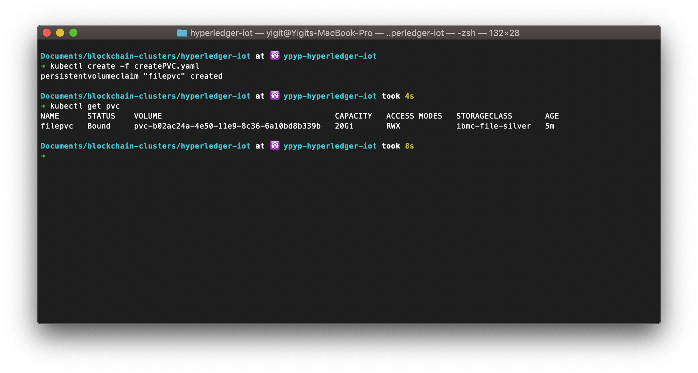</p>

#### 3.2. Copy Artifacts

Once our PV and PVC are created, you are able to copy the local files to the storage on the cloud.

```bash
$ cd ../jobs
$ kubectl apply -f copyArtifactsJob.yaml
$ pod=$(kubectl get pods --selector=job-name=copyartifacts --output=jsonpath={.items..metadata.name})
$ kubectl cp ../artifacts $pod:/shared/
$ kubectl get pods -w
NAME                  READY   STATUS      RESTARTS   AGE
copyartifacts-        0/1     Completed   0
```

After your copyartifacts pod become completed, you can continue with the following step.

<p align="center">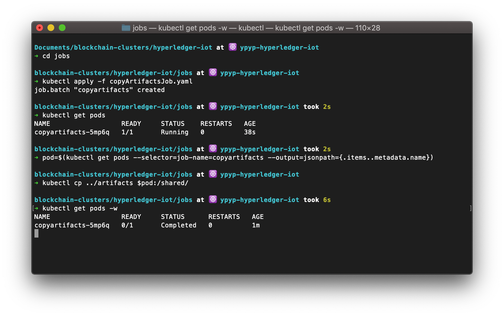</p>

#### 3.3. Generating Hyperledger Fabric key materials and channel config related artifacts

Cryptogen is an utility for generating Hyperledger Fabric key material. It is provided as a means of preconfiguring a network for testing purposes. The configtxgen command allows users to create and inspect channel config related artifacts.

> Note: In the following steps, wait your jobs status to become completed to prevent any conflicts. You can see your pod status by executing "kubectl get pods"

* The following command will generate MSPs (Membership Service Providers)

```bash
$ kubectl apply -f generateCryptoConfig.yaml
job.batch/generate-cryptoconfig created
```

* The following command will generate 'genesis.block' which will be used to deploy Orderer.

```bash
$ kubectl apply -f generateGenesisBlock.yaml
job.batch/generate-genesisblock created
```

* The following command will generate 'channel1.tx' which will be used to create channel.

```bash
$ kubectl apply -f generateChanneltx.yaml
job.batch/generate-channeltx created
```

* The following command will generate 'Org1MSPanchors.tx' and 'Org2MSPanchors.tx' which will be used to set the Anchor Peers in the network.

```bash
$ kubectl apply -f generateAnchorPeerMSPs.yaml
job.batch/generateanchorpeermsps created
```

> Note: A peer node on a channel that all other peers can discover and communicate with. Each Member on a channel has an anchor peer (or multiple anchor peers to prevent single point of failure), allowing for peers belonging to different Members to discover all existing peers on a channel.

<p align="center">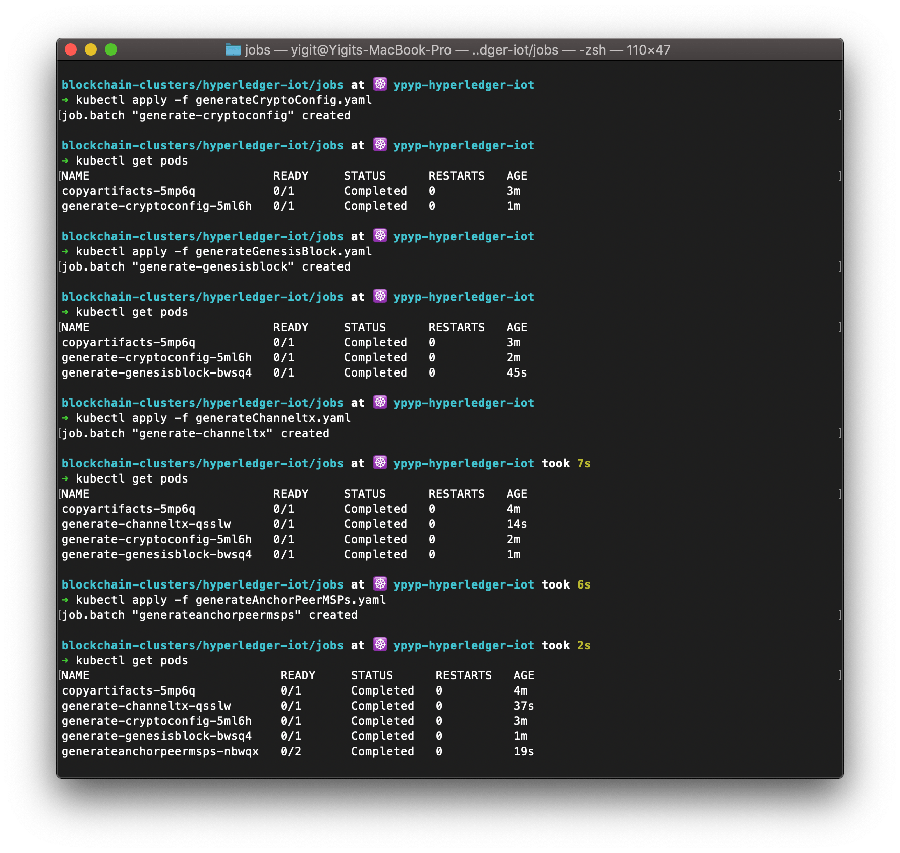</p>

#### 3.4. Network Deployment

You have completed prerequired steps for the network deployment. Now, you will deploy the Hyperledger Fabric components, Certificate Authority, Orderer, and Peers to your cluster.

> Note: In the following step, wait your deployments status to become running to prevent any conflicts. You can see your pod status by executing "kubectl get pods"

```bash
$ cd ../network-deployment
$ sh deployAll.sh
service/orderer created
deployment.apps/orderer created
service/caorg1 created
deployment.apps/caorg1 created
service/org1peer1 created
deployment.apps/org1peer1 created
service/org1peer2 created
deployment.apps/org1peer2 created
service/org2peer1 created
deployment.apps/org2peer1 created
service/org2peer2 created
deployment.apps/org2peer2 created
```

<p align="center">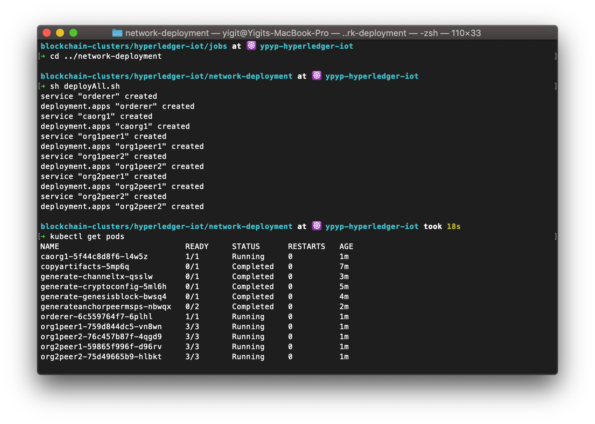</p>

#### 3.5. Network Configuration

You should have your Hyperledger Fabric components are running. In the following steps, we will configure these components according to our use case.

> Note: In the following steps, wait your jobs status to become completed to prevent any conflicts. You can see your pod status by executing "kubectl get pods"

* The following command will create a channel named 'channel1'

```bash
$ cd ../jobs
$ kubectl apply -f create_channel.yaml
job.batch/createchannel created
```

* The following command will join all the peers to the 'channel1'

```bash
$ kubectl apply -f join_channel.yaml
job.batch/joinchannel created
```

<p align="center">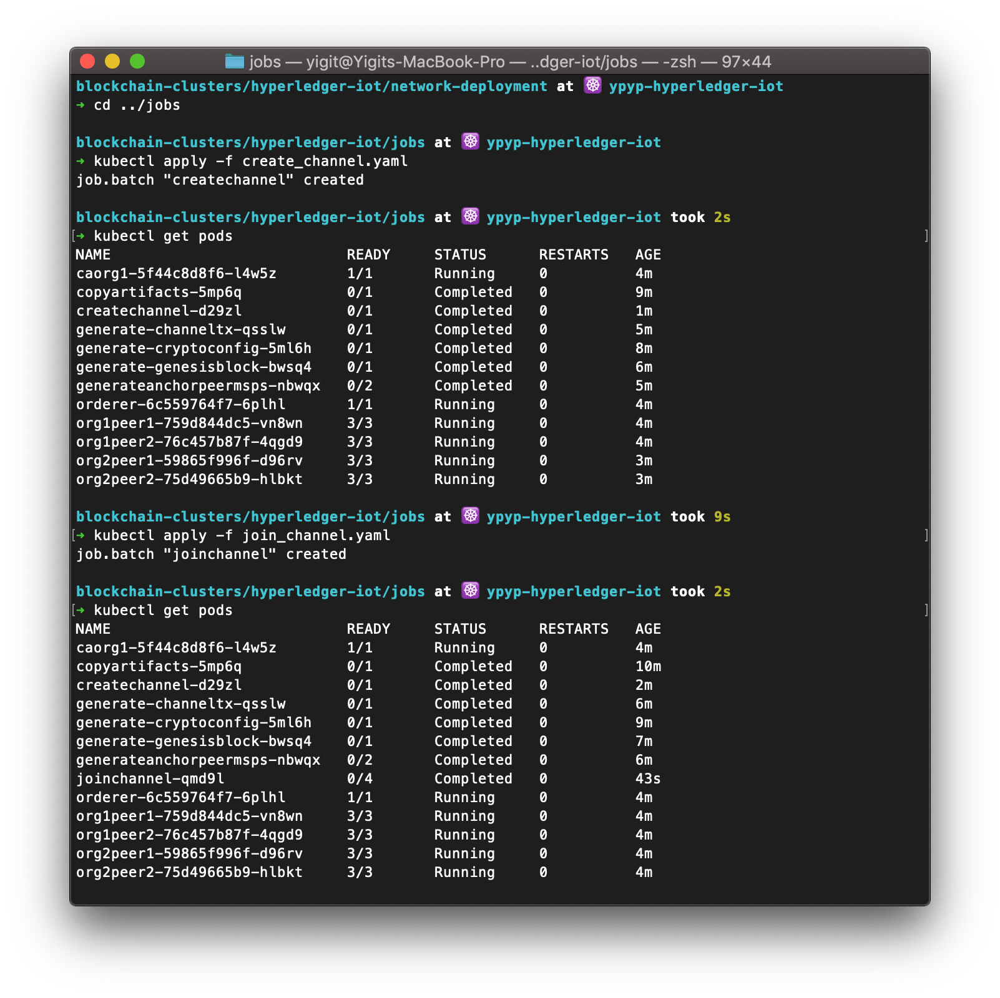</p>

* The following command will install chaincode to peers (org1peer2, org2peer2). These peers will be your endorser peer.

```bash
$ kubectl apply -f chaincode_install.yaml
job.batch/chaincodeinstall created
```

* The following command will instantiate the installed chaincode to the channel. Besides, sets the endorsement policy as requests 1 signature from each of the two organizations.

```bash
$ kubectl apply -f chaincode_instantaite.yaml
job.batch/chaincodeinstantiate created
```

* The following command will update the channel and will set peers (org1peer1, org2peer1) as Anchor Peers.

```bash
$ kubectl apply -f updateAnchorPeers.yaml
job.batch/update-anchorpeers created
```

<p align="center">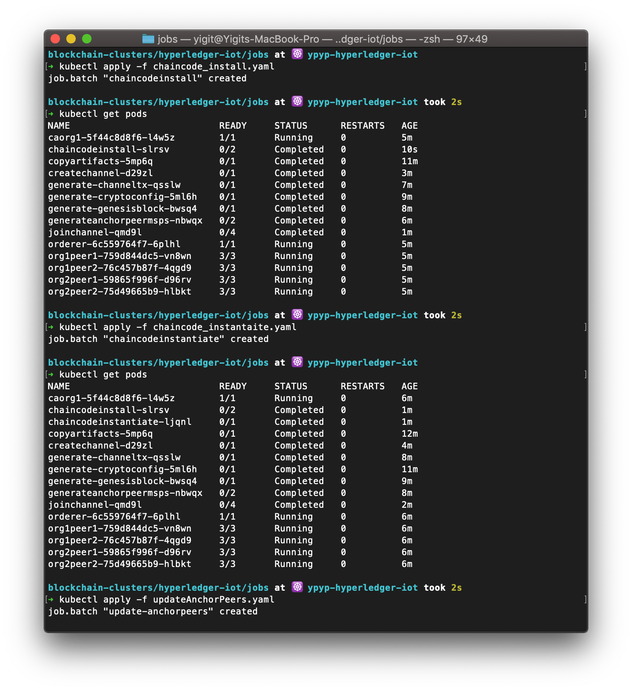</p>

### 4. Deploy Hyperledger Fabric SDK for Node.js

Up until now, you have developed Hyperledger Fabric Network which might be a backend for an application. However, we need a middleware in order to connect the back-end and the front-end. For this purpose you will use Hyperledger Fabric Client SDK for Node.js which makes it possible to use APIs to interact with a Hyperledger Fabric blockchain.

> Note: For the following steps, you must have 'DockerHub Account' in order to push and pull your container images. You can create an account from [here](https://hub.docker.com).

#### 4.1 Build Docker image for Rest API

* The following commands will create a container image and push it to your container registry.

```bash
$ cd ../API
$ docker build . -t <your_account_name>/rest-api
$ docker push <your_account_name>/rest-api
```

<p align="center">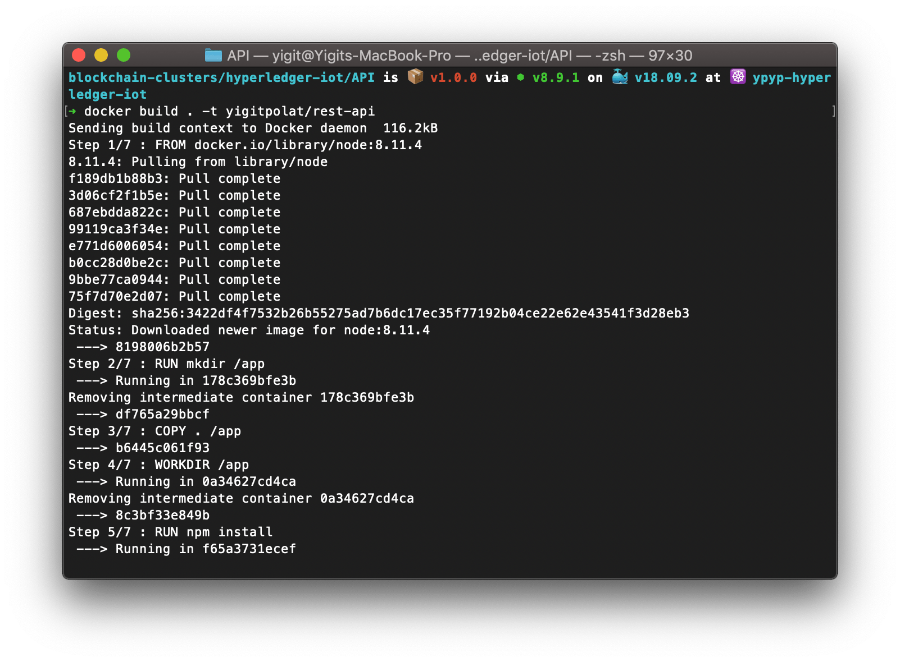</p>
<p align="center">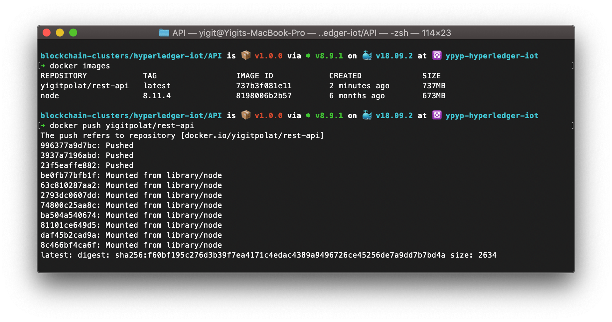</p>

* If you are using a private registry, the Kubernetes Service needs permissions to pull your private container image from your registry.  You can provide the Kubernetes Service with your docker secrets by running this command:

```bash
$ kubectl create secret docker-registry regcred --docker-server=<your-registry-server> --docker-username=<your-name> --docker-password=<your-pword> --docker-email=<your-email>
```

#### 4.2 Deploy and Expose Rest API

* The following commands will first pull the container image from your registry and create a deployment named "rest-api", then create a Kubernetes Service which exposes this deployment

```bash
$ cd ..
$ kubectl create deployment rest-api --image=<your_account_name>/rest-api
deployment.apps/rest-api created
```

```bash
$ kubectl expose deployment rest-api --port=3000 --target-port=3000
service/rest-api exposed
```

<p align="center">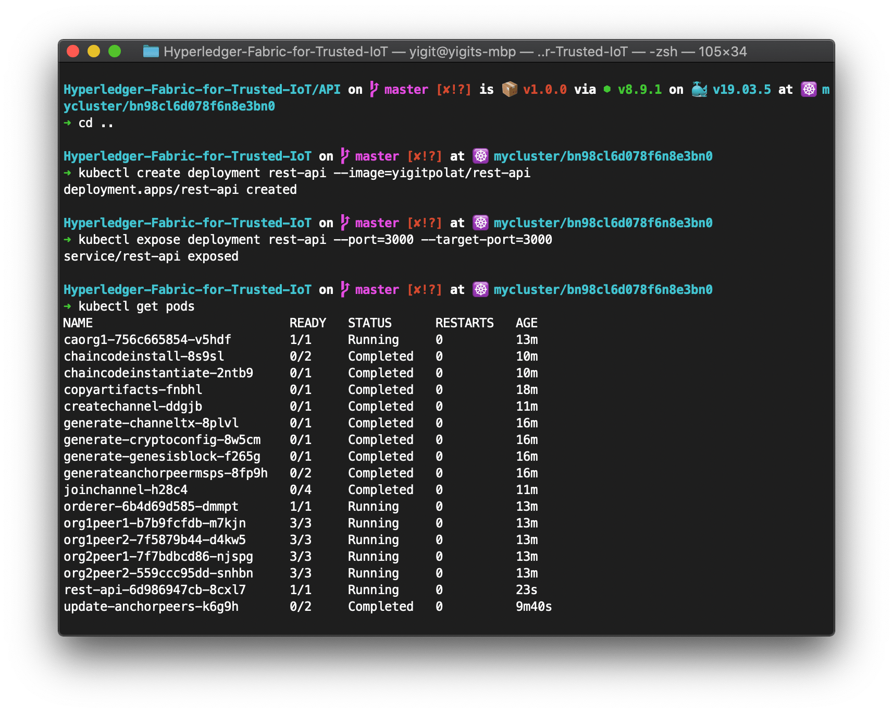</p>

### 5. Deploy Node-RED

Node-RED dashboard will be your front-end. You will be able to see incoming sensor data and the history of the ledger from this dashboard. Besides, all the HTTP requests will be execute via this tool.

> Note: There is Node-RED service in the IBM Cloud Catalog. However, in this pattern you will use Node-RED inside a container.
>
> Note: If you wish to use Node-RED service you can import the flow by using [this](./node-red/node-red_flow.json)

* The following commands will build the Node-RED container image and push it to DockerHub, create a deployment named "node-red", then create a Kubernetes Service which exposes this deployment

* Edit the `Makefile` and enter your `DOCKERHUB_ID:=`

```bash
$ cd node-red
$ make build
$ make push
$ kubectl create deployment node-red --image=<your_account_name>/hyperledger-iot-nodered:1.0.2
deployment.apps/node-red created

```

#### Option 1

* If you have **Free Cluster** use the following command to make nodered deployment accesible from the network.

```bash
$ kubectl apply -f node-red-svc-nodePort.yaml
service/node-red created
```

#### Option 2

* If you have a **Standard Cluster**, IBM Cloud will provide you an Ingress Controller and Application Load Balancer which you can use to access your cluster from network. So that, you need to create ingress rules by following.

Note that, you must modify **hosts** and the **secretName** fields in the "create-ingress.yaml". To learn your Ingress Subdomain and Ingress Secret execute the following commands.

```bash
$ ibmcloud ks cluster get --cluster <your_cluster_name>
```

Now, you can create Node-RED service and Ingress rules.

```bash
$ kubectl apply -f node-red-svc-clusterIP.yaml
$ kubectl apply -f create-ingress.yaml
```

## Understanding the Application

Congratulations! You have deployed your very first Hyperledger Fabric - IoT collabrative application. Now, it is time to understand how the manage the application.

### Access to Node-RED

##### Option 1

If you have Free Cluster follow the below instructions to access to dashboard.

First, execute the below commands to get your Kubernetes Worker Node's external IP.

```bash
$ kubectl get pods -o wide
$ kubectl get nodes -o wide
```

<p align="center">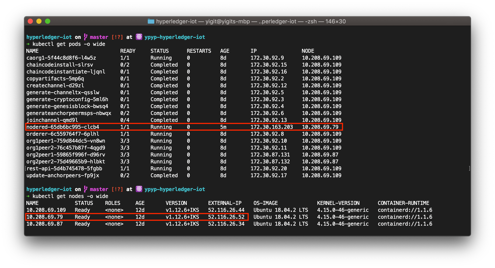</p>

Open your favorite browser and navigate to "Your_external_IP":30002 which will end up with Node-RED service. For example, 52.116.26.52:30002

##### Option 2

If you have Standard Cluster just navigate to host name of your cluster from the browser. For example, node-red.{{HOST-NAME}}.us-south.containers.appdomain.cloud

### Registration

Execute the three HTTP Post request respectively.

* First POST will enroll an admin named "admin" to the Certificate Authority of the Organization 1.
* Second POST will enroll a register and enroll user named "user1" to the Certificate Authority of the Organization 2.
* Third POST Will register a new sensor which will be used to collect the data from.

You will end up with a screen as below. You can see the returning results on the right-hand side.

<p align="center">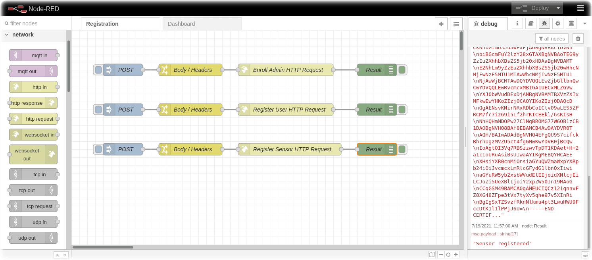</p>

### Dashboard

It is time to create an User Interface to make the application to look fancy.

<p align="center">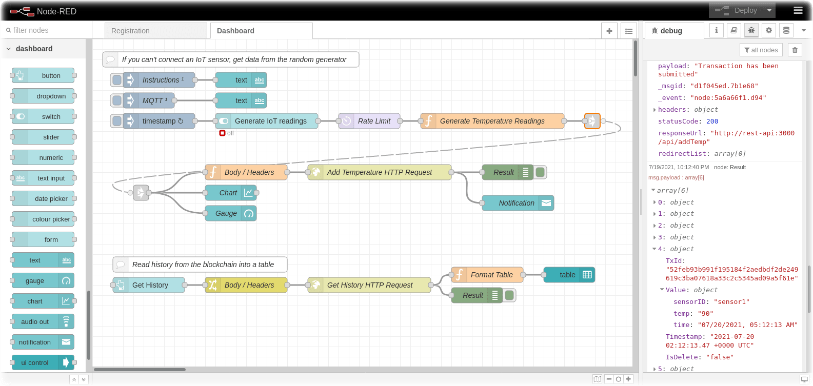</p>

Finally, navigate to "Your_External_IP":30002/ui or nodered.{{HOST-NAME}}.us-south.containers.appdomain.cloud/ui to see your dashboard.
Toggle the `Generate IoT readings` switch to generate simulated IoT sensor data if you are not able to provide a sensor.
 You will be able to see your sensor data live on a gauge and chart. To query the sensor data history stored on the blockchain, navigate to the "Sensor History" tab from the hamburger menu. The data history is coming from the Ledger where the data is storing immutablly in the blockchain.

Here is the screenshots of the final views of the application.

<p align="center">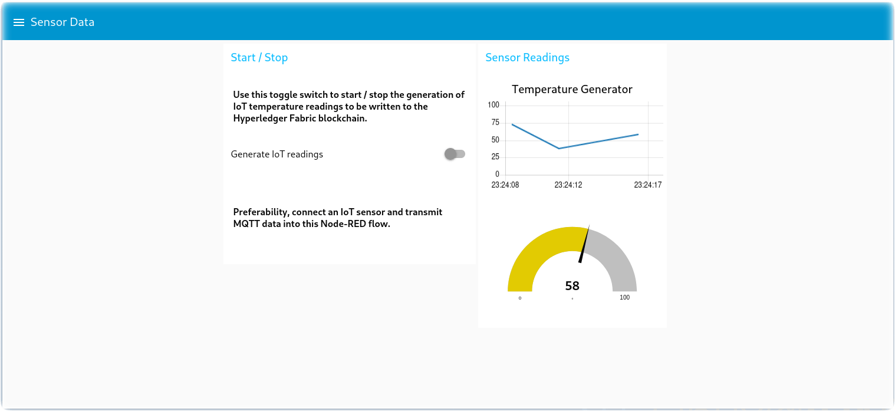</p>

<p align="center">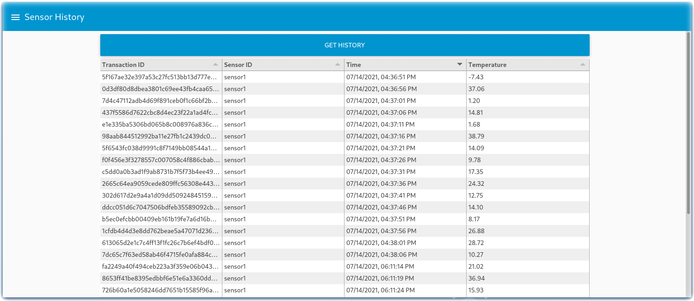</p>

## Extending Code Pattern

Instead developing an application with full capabilities, this minimum viable product is much more understandable and instructive. However, it can be extended with several modifications.

* Adding new functions to chaincode will bring new features to the application
* According to new functions, API endpoints needed to be updated to fulfill the HTTP requests
* Dashboard must be modified depending on the incoming MQTT data

## License

[Apache License 2.0](./LICENSE)
